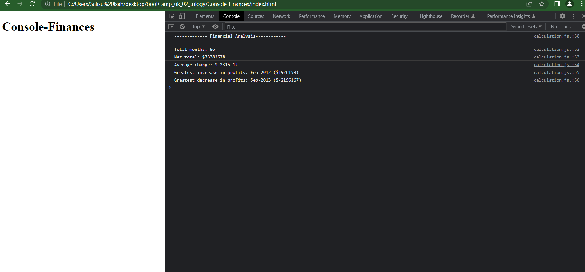

# Console Finances

Analyzing fanancial records of a real life scenerio

## Description

  Creating code for analyzing the financial records of a company when provided with a financial dataset.

## Methodes

* Open the console

### The URL of the GitHub repository.

[Page to Github Console-finances](https://github.com/isahsalisu/Console-Finances.git)

### Link to the deployed project.

[Open The Console to see analysed results]( https://isahsalisu.github.io/Console-Finances/)

### Screenshoot

 
  ## Licence

  * Mit

  